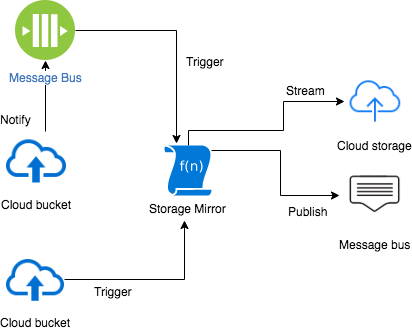
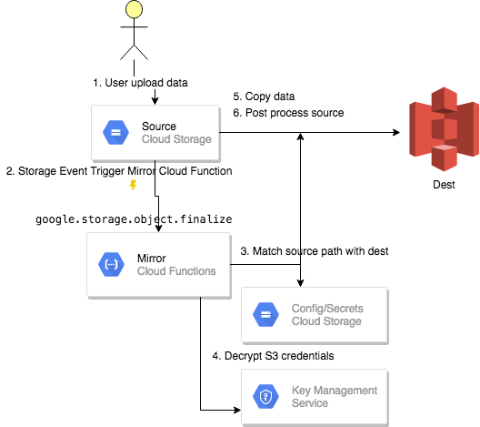
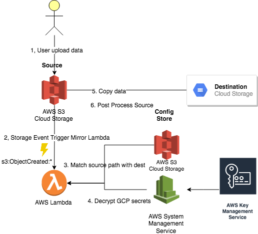
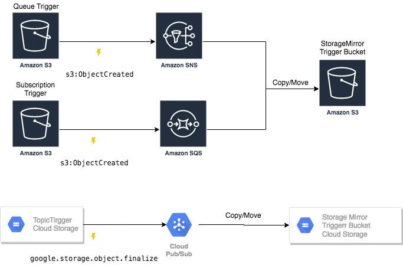

# smirror - Serverless Cloud Storage Mirror

[](https://goreportcard.com/report/github.com/viant/smirror)
[](https://godoc.org/github.com/viant/smirror)

This library is compatible with Go 1.11+

Please refer to [`CHANGELOG.md`](CHANGELOG.md) if you encounter breaking changes.


- [Motivation](#motivation)
- [Introduction](#introduction)
- [Usage](#usage)
   * [Google Storage to S3](#google-storage-to-s3)
   * [Google Storage to Pubsub](#google-storage-to-pubsub)
   * [S3 to Google Storage](#s3-to-google-storage)
   * [S3 To Simple Message Queue](#s3-to-simple-message-queue)
   * [Partitioning](#partitioning)
- [Configuration](#configuration)
   * [Rule](#rule))
        - [Post Action](#post-actions)
   * [Slack Credentials](#slack-credentials)
   * [Streaming settings](#streaming-settings)
   
- [Deployment](#deployment)
- [Notification & Proxy](#notification--proxy)
- [End to end testing](#end-to-end-testing)
- [Monitoring ](#monitoring)
- [Replay ](#replay)
- [Limitation](#limitation)
- [Code Coverage](#code-coverage)
- [License](#license)
- [Credits and Acknowledgements](#credits-and-acknowledgements)


## Motivation

When dealing with various cloud providers, it is a frequent use case to move seamlessly data from one cloud resource to another.
This resource could be any cloud storage or even a cloud message bus. During mirroring a data may be transformed
or partitioned all driven by declarative mirroring rules.


## Introduction

[](images/cloud_mirror.png)


## Usage

**Google Storage to S3 Mirror**

[](images/g3tos3mirror.png)

### Google Storage to S3


To mirror data from google storage that matches /data/ prefix and '.csv.gz' suffix to s3://destBucket/data
the following rule can be used 

[@gs://$configBucket/StorageMirror/Rules/rule.json](usage/gs_to_s3/rule.json)
```json
[
  {
    "Source": {
      "Prefix": "/data/",
      "Suffix": ".csv.gz"
    },
    "Dest": {
      "URL": "s3://destBucket/data",
      "Credentials": {
        "URL": "gs://sourceBucket/secret/s3-cred.json.enc",
        "Key": "projects/my_project/locations/us-central1/keyRings/my_ring/cryptoKeys/my_key"
      }
    },
    "Codec": "gzip",
    "Info": {
      "Workflow": "My workflow name here",
      "Description": "my description",
      "ProjectURL": "JIRA/WIKi or any link referece",
      "LeadEngineer": "my@dot.com"
    }
  }
]
```


### S3 to Google Storage

[](images/s3togsmirror.png)


To mirror data from S3 that matches /myprefix/ prefix and '.csv.gz' suffix to gs://destBucket/data
splitting source file into maximum 8 MB files in destination you can use the following


[@s3://$configBucket/StorageMirror/Rules/rule.json](usage/s3_to_gs/rule.json)
```json
[
  {
    "Source": {
      "Prefix": "/myprefix/",
      "Suffix": ".csv.gz"
    },
    "Dest": {
      "URL": "gs://${destBucket}",
      "Credentials": {
        "Parameter": "StorageMirror.GCP-DestProject",
        "Key": "smirror"
      }
    },
    "Split": {
      "MaxSize": 8388608,
      "Template": "%s_%05d"
    },
    "Codec": "gzip"
  }
]
```

### Google Storage To Pubsub

[](images/g3Topubsub.png)


To mirror data from google storage that match /myprefix/ prefix and '.csv' suffix to pubsub 'myTopic' topic
you can use the following rule

[@gs://$configBucket/StorageMirror/Rules/rule.json](usage/gs_to_pubsub/rule.json)
```json
[
  {
    "Source": {
      "Prefix": "/myprefix/",
      "Suffix": ".csv"
    },
    "Dest": {
      "Topic": "myTopic"
    },
    "Split": {
      "MaxSize": 524288
    },
    "OnSuccess": [
      {
        "Action": "delete"
      }
    ],
    "OnFailure": [
      {
        "Action": "move",
        "URL": "gs:///${opsBucket}/StorageMirror/errors/"
      }
    ]
  }
]
```

Source data in divided with a line boundary with max size specified in split section.
Each message also get 'source' attribute with source path part.


### S3 To Simple Message Queue

To mirror data from s3  that match /myprefix/ prefix and '.csv' suffix to simple message 'myQueue'
you can use the following rule


[@s3://$configBucket/StorageMirror/Rules/rule.json](usage/s3_to_sqs/rule.json)
```json
[
  {
    "Source": {
      "Prefix": "/myprefix/",
      "Suffix": ".csv"
    },
    "Dest": {
      "Queue": "myQueue"
    },
    "Split": {
      "MaxLines": 1000,
      "Template": "%s_%05d"
    },
    "OnSuccess": [
      {
        "Action": "delete"
      }
    ],
    "OnFailure": [
      {
        "Action": "move",
        "URL": "s3:///${opsBucket}/StorageMirror/errors/"
      }
    ]
  }
]

```


## Partitioning

To partition data from Google Storage that match /data/subfolder  prefix and '.csv' suffix to topic mytopic_p$partition you can use the following rule.
The process builds partition key from CSV field[0] with mod(2) 
Destination topic is dynamically evaluated based on parition value.
 

[@gs://$configBucket/StorageMirror/Rules/rule.json](usage/partition/rule.json)

```json
[
  {
    "Source": {
      "Prefix": "/data/subfolder",
      "Suffix": ".csv"
    },
    "Dest": {
      "Topic": "mytopic_p$partition"
    },

    "Split": {
      "MaxSize": 1048576,
      "Partition": {
        "FieldIndex": 0,
        "Mod": 2
      }
    },
    "OnSuccess": [
      {
        "Action": "delete"
      }
    ],
    "PreserveDepth": 1
  }
]
```

## Configuration

### Rule

Global config delegates a mirror rules to a separate location, 

- **Mirrors.BaseURL**: mirror rule location 
- **Mirrors.CheckInMs**: frequency to reload ruled from specified location

Typical rule defines the following matching Source and mirror destination which are defined are [Resource](config/resource.go)

##### Source settings

- **Source.Prefix**: optional matching prefix
- **Source.Suffix**: optional matching suffix
- **Source.Filter**: optional regexp matching filter
- **Source.Credentials**: optional source credentials
- **Source.CustomKey**: optional server side encryption AES key

#####  Destination settings

- **Dest.URL**: destination base location 
- **Dest.Credentials**: optional dest credentials
- **Dest.CustomKey**: optional server side encryption AES key


######  Destination Proxy settings

- **Dest.Proxy**: optional http proxy
 
- **Dest.Proxy.URL**: http proxy URL
- **Dest.Proxy.Fallback**: flag to fallback to regular client if proxy error
- **Dest.Proxy.TimeoutMs**: connection timeout
    

##### Message bus destination

- **Dest.Topic**: pubsub topic
- **Dest.Queue**: simple message queue

When destination is a message bus, you have to specify split option, 
when data is published to destination path defined by split template. Source attribute is added:
For example if original resource xx://mybucket/data/p11/events.csv is divided into 2 parts,  two messages are published
with data payload and /data/p11/0001_events.csv and /data/p11/0002_events.csv source attribute respectively.

Both topic and queue support **$partition** variable to expanded ir with partition when Split.Partition setting is used. 


##### Payload recovery

The following attribute control payload recovery. For JSON format any line with
invalid JSON get excluded. For CSV each line is adjusted (expadnded/truncated) to specified 
number columns.

- **Recover.Format** (CSV or JSON)
- **Recover.Delimiter**  
- **Recover.LazyQuotes** 
- **Recover.FieldCount** 


##### Payload substitution

- **Replace** collection on replacement rules

##### Splitting payload into smaller parts

Optionally mirror process can split source content lines by size or max line count.

- **Split.MaxLines**: maximum lines in dest splitted file
- **Split.MaxSize**: maximum size in dest splitted file (lines are presrved)
- **Split.Template**: optional template for dest file name with '%04d_%s' default value, 
_where_:
    * %d or $chunk - is expanded with a split number  
    * %s or $name is replaced with a file name, 
    * %v or $partition is replaced with a partition key value (if applicable)

- **Split.Partition**: partition allows you splitting by partition
- **Split.Partition.Field**: name of filed (JSON/Avro)
- **Split.Partition.FieldIndex**: field index (CSV) 
- **Split.Partition.Separator**: optional separator, default (,) (CSV)
- **Split.Partition.Hash**: optional hash for int64 partition value, the following are supported
  - md5
  - fnv
  - murmur
- **Split.Partition.Mod**: optional moulo value for numeric partition value   


##### Data Transcoding

- **Transcoding.Source** transcoding source
- **Transcoding.Dest** transcoding destination
- **Transcoding.PathMapping** optional path mapping

Where Source and Dest support the following attributes:

- **Format**  on of the following: CSV,JSON,AVRO
- **Fields**         CSV fields (field names are directly mapped to avro unless path mapping is used)
- **HasHeader**      flag is CSV has header
- **Delimiter**      CSV delimiter
- **LazyQuotes**     flag to use CSV lazy quotes
- **SchemaURL**      avro schema URL
- **RecordPerBlock** avro setting


##### Source path dest naming settings

By default source the whole source path is copied to destination

 - **PreserveDepth**: optional number to manipulate source path transformation, positive number
 preserves number of folders from leaf side, and negative truncates from root side.
 

To see preserve depth control assume the following: 
- _source URL_: xx://myXXBucket/folder/subfolder/grandsubfolder/asset.txt
- _dest base URL_: yy://myYYBucket/zzz

| PreserveDepth | dest URL | description |
| --- | --- | --- |
| Not specified | yy://myYYBucket/zzz//folder/subfolder/grandsubfolder/asset.txt | the whole source path is preserved |  
| 1 | yy://myYYBucket/zzz/grandsubfolder/asset.txt | source path adds 1 element from leaf size  |
| -2 | yy://myYYBucket/zzz/grandsubfolder/asset.txt | source path 2 elements truncated from root side  |
| -1 | yy://myYYBucket/zzz/subfolder/grandsubfolder/asset.txt | source path 1 element truncated from root side  |


##### Compression options

By default is not split or replacement rules is specified, source is copied to destination without decompressing source archive.

- **Codec** defines destination codec (gzip is only option currently supported).
- **Uncompress**: uncompress value is set when split or replace options are used, you can this value for zip/tar source file if you need
mirror individual archive assets.   


##### Secrets options

A secrets data use KMS to decypt/encrypt GCP/AWS/Slack secrets or credentials.

 
- **Credentials.Key**: KMS key or alias name
- **Credentials.Parameter**: aws system manager parameters name storing encrypted secrets
- **Credentials.URL**: location for encrypted secrets 


See how to secure:
- [AWS Credentials](deployment/README.md#securing-aws-credentials) 
- [GCP Google Secrets](deployment/README.md#secure-gcp-credentials-google-secrets)
- [Slack Token](deployment/README.md#securing-slack-credentials)
 

##### Server-Side Encryption 

Server side encryption with Customer-Provided Encryption Keys (AES-256)

- **CustomKey.Key**: KMS key or alias name
- **CustomKey.Parameter**: aws system manager parameters name storing encrypted secrets
- **CustomKey.URL**: location for encrypted secrets 


All security sensitive credentials/secrets are stored with KMS service. 
In Google Cloud Platform in google storage.
In Amazon Web Srvice in System Management Service.
See [deployment](deployment/README.md) details for securing credentials.


Check end to end testing scenario for various rule examples.


### Slack Credentials

To you notify post action you have to supply encryted slack credentials:

where the raw (unecrypted) content uses the following JSON format 

```json
{
        "Token":"xoxp-myslack_token"
}
```

- **SlackCredentials.Key**: KMS key or alias name
- **SlackCredentials.Parameter**: aws system manager parameters name storing encrypted secrets
- **SlackCredentials.URL**: location for encrypted secrets 


#### Post actions

Each mirror rule accepts collection on OnSuccess and OnFailure post actions.

The following action are supported:

- **delete**: remove source (trigger asset)


```json
{
   "OnSuccess": [{"Action": "delete"}]
}
```

- **move**: move source to specified destination

```json
{
  "OnSuccess": [{
          "Action": "move",
          "URL": "gs:///${opsBucket}/StorageMirror/processed/"
 }],
 "OnFailure": [{
        "Action": "move",
        "URL": "gs:///${opsBucket}/StorageMirror/errors/",
 }]
}
```

- **notify**: notify slack

```json
{
  "OnSuccess": [{
        "Action": "notify",
        "Title": "Transfer $SourceURL done",
        "Message": "success !!",
        "Channels": ["#e2e"],
        "Body": "$Response"
  }]
}
```


### Streaming settings

By default any payload smaller than 1 GB is loaded into memory to compute checksum(crc/md5) by upload operation, this means that lambda needs enough memory.
Larger content is streamed with checksum computation skipped on upload to reduce memory footprint. 

The following global config settings controls streaming behaviour:
- **Streaming.ThresholdMb**: streaming option threshold
- **Streaming.PartSizeMb**: download stream part/chunk size
- **ChecksumSkipThresholdMb**: skiping checksum on upload threshold

Streaming can be also applied on the rule level.


## Deployment

The following are used by storage mirror services:

**Prerequisites**

- _$configBucket_: bucket storing storage mirror configuration and mirror rules
- _$triggerBucket_: bucket storing data that needs to be mirror, event triggered by GCP
- _$opsBucket_: bucket string error, processed mirrors
-  Mirrors.BaseURL: location storing routes rules as JSON Array

The following [Deployment](deployment/mirror/README.md) details storage mirror generic deployment.


## Notification & Proxy


To simplify mirroring maintenance only one instance of storage mirror is recommended per project or region.
Since lambda/cloud function accept only one trigger per bucket you can use sqs/sns/pubsub notification bucket to
propagate source event from any bucket to the StorageMirror instance by either invoking or copying/moving underlying resource to trigger bucket.

When copy/move setting is used to trigger control StrageMirror events, the original bucket is added as prefix to the resource path:
For example source path gs://myTopicTriggerBucket/myPath/asset.txt is transformed to gs://mytriggerBucet/myTopicTriggerBucket/myPath/asset.txt 
when copy/move proxy option is used.


[](images/mbus_mirror.png)


All proxy share simple [config](usage/s3proxy.json) with dest URL.


#### Cron scheduler

In case you do not own or control a bucket that has some mirroring assets you can use [cron lambda/cloud function](cron/README.md).
It  pulls external URL to simulate cloud storage event by coping it to main trigger buceket.


## Monitoring 

[StorageMonitor](mon) can be used to monitor trigger and error buckets.


**On Google Cloud Platform:**

```bash
curl -d @monitor.json -X POST  -H "Content-Type: application/json"  $monitorEndpoint
```

[@monitor.json](usage/monitor.json)


_where:_
- **UnprocessedDuration** - check for any unprocessed data file over specified time
- **ErrorRecency** - specified errors within specified time


On Amazon Web Service:

```endly monitor.yaml authWith=aws-e2e```
[@monitor.yaml](usage/monitor.yaml)


## Replay

Sometimes during regular operation cloud function or lambda may terminate with error, leaving unprocess file. 
Replay function will move data back and forth between trigger and replay bucket triggering another event.
Each replayed file leaves trace in replay bucket  to control no more then one replay per file.


```bash
curl -d @replay.json -X POST  -H "Content-Type: application/json"  $replayEndpoint
```

[@replay.json](usage/replay.json)
```json
{
  "TriggerURL": "gs://${triggerBucket}",
  "ReplayBucket":"${replayBucket}",
  "UnprocessedDuration": "1hour"
}
```

_where:_
- **UnprocessedDuration** - check for any unprocessed data file over specified time


## Limitation

Serverless restriction
- execution time
- network restriction
- memory limitation  

## End to end testing

### Prerequisites:

  - [Endly e2e runner](https://github.com/viant/endly/releases) or [endly docker image](https://github.com/viant/endly/tree/master/docker)
  - [Google secrets](https://github.com/viant/endly/tree/master/doc/secrets#google-cloud-credentials) for dedicated e2e project  ~/.secret/gcp-e2e.json 
  - [AWS secrets](https://github.com/viant/endly/tree/master/doc/secrets#asw-credentials) for dedicated e2e account ~/.secret/aws-e2e.json 

```bash
git clone https://github.com/viant/smirror.git
cd smirror/e2e
### Update mirrors bucket for both S3, Google Storage in e2e/run.yaml (gsTriggerBucket, s3TriggerBucket)
endly 
```


## Code Coverage

[](https://gocover.io/github.com/viant/smirror)

	
<a name="License"></a>
## License

The source code is made available under the terms of the Apache License, Version 2, as stated in the file `LICENSE`.

Individual files may be made available under their own specific license,
all compatible with Apache License, Version 2. Please see individual files for details.

<a name="Credits-and-Acknowledgements"></a>

## Credits and Acknowledgements

**Library Author:** Adrian Witas
